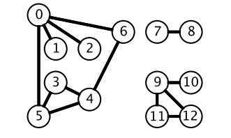

# 索引

- [算法思想](#算法思想)
    - [双指针](#双指针)
    - [排序](#排序)
    - [贪心思想](#贪心思想)
    - [二分查找](#二分查找)
    - [分治](#分治)
    - [搜索(推荐阅读)](#搜索)
    - [动态规划(未完成)](#动态规划)
    - [数学(未完成)](#数学)
    
- [数据结构相关](#数据结构相关)
    - [链表](#链表)
    - [树](#树)
    - [栈和队列](#栈和队列)
    - [哈希表](#哈希表)
    - [字符串](#字符串)
    - [数组和矩阵](#数组与矩阵)
    - [图](#图)
    - [位运算(未完成)](#位运算)
    
- [参考[cyc2018-LeetCode题解]](https://github.com/CyC2018/CS-Notes/blob/master/notes/Leetcode%20%E9%A2%98%E8%A7%A3%20-%20%E7%9B%AE%E5%BD%95.md)

## 算法思想

#### 双指针

双指针主要用于遍历数组, 两个指针指向不同的元素, 从而协同完成任务, 包括指针碰撞, 快慢指针, 双指针

- [1. 有序数组的 Two Sum](https://leetcode-cn.com/problems/two-sum-ii-input-array-is-sorted/description/) [[java]](../src/lc167.java)
- [2. 两数平方和](https://leetcode-cn.com/problems/sum-of-square-numbers/description/) [[java]](../src/lc633.java)
- [3. 反转字符串中的元音字符](https://leetcode-cn.com/problems/sum-of-square-numbers/description/) [[java]](../src/lc345.java)
- [4. 回文字符串](https://leetcode-cn.com/problems/valid-palindrome-ii/description/) [[java]](../src/lc680.java)
- [5. 归并两个有序数组](https://leetcode-cn.com/problems/merge-sorted-array/description/) [[java]](../src/lc080.java)
- [6. 判断链表是否存在环](https://leetcode-cn.com/problems/linked-list-cycle/description/) [[java]](../src/lc141.java)
- [7. 最长子序列](https://leetcode-cn.com/problems/longest-word-in-dictionary-through-deleting/description/) [[java]](../src/lc524.java)

#### 排序

- 快速选择

    用于求解 Kth Element 问题, 也就是第 K 个元素的问题. 可以使用快速排序的 partition() 进行实现. 需要先打乱数组, 否则最坏情况下时间复杂度为 O(n ^ 2)
    
    - [Kth Element](https://leetcode-cn.com/problems/kth-largest-element-in-an-array/description/) [[java]](../src/lc215.java)
    
- 堆

    用于求解 TopK Elements 问题, 也就是 K 个最小元素的问题. 可以维护一个大小为 K 的最小堆, 最小堆中的元素就是最小元素. 最小堆需要使用大顶堆来实现, 大顶堆表示堆顶元素是堆中最大元素. 这是因为我们要得到 k 个最小的元素, 因此当遍历到一个新的元素时, 需要知道这个新元素是否比堆中最大的元素更小, 更小的话就把堆中最大元素去除, 并将新元素添加到堆中. 所以我们需要很容易得到最大元素并移除最大元素, 大顶堆就能很好满足这个要求.
    
    堆也可以用于求解 Kth Element 问题, 得到了大小为 k 的最小堆之后, 因为使用了大顶堆来实现, 因此堆顶元素就是第 k 大的元素.
    
    快速选择也可以求解 TopK Elements 问题, 因为找到 Kth Element 之后, 再遍历一次数组, 所有小于等于 Kth Element 的元素都是 TopK Elements. 
    
    可以看到, 快速选择和堆排序都可以求解 Kth Element 和 TopK Elements 问题
    
    - [出现频率最多的 k 个元素](https://leetcode-cn.com/problems/top-k-frequent-elements/description/) [[java]](../src/lc347.java)

- 桶排序
    
    - [按照字符出现次数对字符串排序](https://leetcode-cn.com/problems/sort-characters-by-frequency/description/) [[java]](../src/lc451.java)
    
- 荷兰国旗问题

    荷兰国旗包含三种颜色: 红, 白, 蓝.
    
    有三种颜色的球, 算法的目标是将这三种球按颜色顺序正确地排列. 它其实是三向切分快速排序的一种变种, 在三向切分快速排序中, 每次切分都将数组分成三个区间: 小于切分元素, 等于切分元素, 大于切分元素, 而该算法是将数组分成三个区间: 等于红色, 等于白色, 等于蓝色.
    
    - [按颜色进行排序](https://leetcode-cn.com/problems/sort-colors/description/) [[java]](../src/lc075.java)

#### 贪心思想

贪心算法一般用来解决需要 "找到要做某事的最小数量" 或 "找到在某些情况下适合的最大物品数量" 的问题, 且提供的是无序的输入

贪心算法的思想是每一步都选择最佳解决方案, 最终获得全局最佳的解决方案

标准解决方案具有O(n * logn)的时间复杂度且由以下两部分组成:

- 思考如何排序输入数据, O(n * logn)的时间复杂度

- 思考如何解析排序后的数据, O(n)的时间复杂度

如果输入数据本身有序, 则我们不需要进行排序, 那么该贪心算法具有O(n)的时间复杂度

如何证明你的贪心思想具有全局最优的效果: 可以使用反证法来证明

- [1. 分配饼干]() [[java]](../src/lc455.java)
- [2. 不重叠的区间个数]() [[java]](../src/lc435.java)
- [3. 投飞镖刺破气球]() [[java]](../src/lc452.java)
- [4. 根据身高和序号重组队列]() [[java]](../src/lc406.java)
- [5. 买卖股票最大的收益]() [[java]](../src/lc121.java)
- [6. 买卖股票的最大收益 II]() [[java]](../src/lc122.java)
- [7. 种植花朵]() [[java]](../src/lc605.java)
- [8. 判断是否为子序列]() [[java]](../src/lc392.java)
- [9. 修改一个数成为非递减数组]() [[java]](../src/lc665.java)
- [10. 子数组最大的和]() [[java]](../src/lc053.java)
- [11. 分隔字符串使同种字符出现在一起]() [[java]](../src/lc763.java)

#### 二分查找

正常实现

```
Input : [1,2,3,4,5]
key : 3
return the index : 2
```

```java
public int binarySearch(int[] nums, int key) {
    int l = 0, h = nums.length - 1;
    while (l <= h) {
        int m = l + (h - l) / 2;
        if (nums[m] == key) {
            return m;
        } else if (nums[m] > key) {
            h = m - 1;
        } else {
            l = m + 1;
        }
    }
    return -1;
}
```

时间复杂度

二分查找也称为折半查找, 每次都能将查找区间减半, 这种折半特性的算法时间复杂度为 O(logn)

m 计算

有两种计算中值 m 的方式: 

- m = (l + h) / 2
- m = l + (h - l) / 2

l + h 可能出现加法溢出, 也就是说加法的结果大于整型能够表示的范围. 但是 l 和 h 都为正数, 因此 h - l 不会出现加法溢出问题. 所以, 最好使用第二种计算法方法.

未成功查找的返回值

循环退出时如果仍然没有查找到 key, 那么表示查找失败. 可以有两种返回值: 

- -1: 以一个错误码表示没有查找到 key
- l: 将 key 插入到 nums 中的正确位置

变种

二分查找可以有很多变种, 实现变种要注意边界值的判断. 例如在一个有重复元素的数组中查找 key 的最左位置的实现如下: 

```java
public int binarySearch(int[] nums, int key) {
    int l = 0, h = nums.length - 1;
    while (l < h) {
        int m = l + (h - l) / 2;
        if (nums[m] >= key) {
            h = m;
        } else {
            l = m + 1;
        }
    }
    return l;
}
```

该实现和正常实现有以下不同: 

- h 的赋值表达式为 h = m
- 循环条件为 l < h
- 最后返回 l 而不是 -1

在 nums[m] >= key 的情况下, 可以推导出最左 key 位于 [l, m] 区间中, 这是一个闭区间. h 的赋值表达式为 h = m, 因为 m 位置也可能是解.

在 h 的赋值表达式为 h = m 的情况下, 如果循环条件为 l <= h, 那么会出现循环无法退出的情况, 因此循环条件只能是 l < h. 以下演示了循环条件为 l <= h 时循环无法退出的情况: 

```
nums = {0, 1, 2}, key = 1
l   m   h
0   1   2  nums[m] >= key
0   0   1  nums[m] < key
1   1   1  nums[m] >= key
1   1   1  nums[m] >= key
...
```
当循环体退出时, 不表示没有查找到 key, 因此最后返回的结果不应该为 -1. 为了验证有没有查找到, 需要在调用端判断一下返回位置上的值和 key 是否相等.

- [1. 求开方](https://leetcode-cn.com/problems/sqrtx/description/) [[java]](../src/lc069.java)
- [2. 大于给定元素的最小元素](https://leetcode-cn.com/problems/find-smallest-letter-greater-than-target/description/) [[java]](../src/lc744.java)
- [3. 有序数组的 Single Element](https://leetcode-cn.com/problems/single-element-in-a-sorted-array/description/) [[java]](../src/lc540.java)
- [4. 第一个错误的版本](https://leetcode-cn.com/problems/first-bad-version/description/) [[java]](../src/lc278.java)
- [5. 旋转数组的最小数字](https://leetcode-cn.com/problems/find-minimum-in-rotated-sorted-array/description/) [[java]](../src/lc153.java)
- [6. 查找区间](https://leetcode-cn.com/problems/find-first-and-last-position-of-element-in-sorted-array/) [[java]](../src/lc034.java)

#### 分治

- [1. 给表达式加括号](https://leetcode-cn.com/problems/different-ways-to-add-parentheses/) [[java]](../src/lc241.java)
- [2. 不同的二叉搜索树](https://leetcode-cn.com/problems/unique-binary-search-trees-ii/) [[java]](../src/lc095.java)

#### 搜索

深度优先搜索和广度优先搜索广泛运用于树和图中, 但是它们的应用远远不止如此. 

- BFS

     

    广度优先搜索一层一层地进行遍历, 每层遍历都以上一层遍历的结果作为起点, 遍历一个距离能访问到的所有节点. 需要注意的是, 遍历过的节点不能再次被遍历.

    第一层:

        0 -> {6, 2, 1, 5}
    
    第二层:

        6 -> {4}
        2 -> {}
        1 -> {}
        5 -> {3}
    第三层:

        4 -> {}
        3 -> {}
    
    每一层遍历的节点都与根节点距离相同. 设 di 表示第 i 个节点与根节点的距离, 推导出一个结论: 对于先遍历的节点i与后遍历的节点 j, 有 di <= dj. 利用这个结论, 可以求解最短路径等 `最优解` 问题: 第一次遍历到目的节点, 其所经过的路径为最短路径. 应该注意的是, 使用 BFS 只能求解无权图的最短路径, 无权图是指从一个节点到另一个节点的代价都记为 1.

    在程序实现 BFS 时需要考虑以下问题:

    1. 队列: 用来存储每一轮遍历得到的节点;
    2. 标记: 对于遍历过的节点, 应该将它标记, 防止重复遍历.

    例题: 
    
    - [1. 计算在网格中从原点到特定点的最短路径长度](https://leetcode-cn.com/problems/shortest-path-in-binary-matrix/) [[java]](../src/lc1091.java)
    - [2. 组成整数的最小平方数数量](https://leetcode-cn.com/problems/perfect-squares/) [[java]](../src/lc279.java)
    - [3. 最短单词路径](https://leetcode-cn.com/problems/word-ladder/) [[java]](../src/lc127.java)
    
- DFS

    

    广度优先搜索一层一层遍历, 每一层得到的所有新节点, 要用队列存储起来以备下一层遍历的时候再遍历.

    而深度优先搜索在得到一个新节点时立即对新节点进行遍历: 从节点 0 出发开始遍历, 得到到新节点 6 时, 立马对新节点 6 进行遍历, 得到新节点 4; 如此反复以这种方式遍历新节点, 直到没有新节点了, 此时返回. 返回到根节点 0 的情况是, 继续对根节点 0 进行遍历, 得到新节点 2, 然后继续以上步骤.

    从一个节点出发, 使用 DFS 对一个图进行遍历时, 能够遍历到的节点都是从初始节点可达的, DFS 常用来求解这种 `可达性` 问题.

    在程序实现 DFS 时需要考虑以下问题:

    栈: 用栈来保存当前节点信息, 当遍历新节点返回时能够继续遍历当前节点. 可以使用递归栈.
    标记: 和 BFS 一样同样需要对已经遍历过的节点进行标记.

    - [1. 矩阵中的连通分量数目](https://leetcode-cn.com/problems/number-of-islands/description/) [[java]](../src/lc200.java)
    - [2. 查找最大的连通面积](https://leetcode-cn.com/problems/max-area-of-island/description/) [[java]](../src/lc695.java)
    - [3. 好友关系的连通分量数目](https://leetcode-cn.com/problems/friend-circles/description/) [[java]](../src/lc547.java)
    - [4. 填充封闭区域](https://leetcode-cn.com/problems/surrounded-regions/description/) [[java]](../src/lc130.java)
    - [5. 能到达的太平洋和大西洋的区域](https://leetcode-cn.com/problems/pacific-atlantic-water-flow/description/) [[java]](../src/lc417.java)
    
- Backtracking

    Backtracking(回溯)属于 DFS.
    
    普通 DFS 主要用在 `可达性问题` , 这种问题只需要执行到特点的位置然后返回即可.
    而 Backtracking 主要用于求解 `排列组合` 问题, 例如有 { 'a', 'b', 'c' } 三个字符, 求解所有由这三个字符排列得到的字符串, 这种问题在执行到特定的位置返回之后还会继续执行求解过程.
    因为 Backtracking 不是立即返回, 而要继续求解, 因此在程序实现时, 需要注意对元素的标记问题: 
    
    1. 在访问一个新元素进入新的递归调用时, 需要将新元素标记为已经访问, 这样才能在继续递归调用时不用重复访问该元素;
    2. 但是在递归返回时, 需要将元素标记为未访问, 因为只需要保证在一个递归链中不同时访问一个元素, 可以访问已经访问过但是不在当前递归链中的元素.

    例题: 
    
    - [1. 数字键盘组合](https://leetcode-cn.com/problems/letter-combinations-of-a-phone-number/description/) [[java]](../src/lc017.java)
    - [2. IP 地址划分](https://leetcode-cn.com/problems/restore-ip-addresses/description/) [[java]](../src/lc093.java)
    - [3. 在矩阵中寻找字符串](https://leetcode-cn.com/problems/word-search/description/) [[java]](../src/lc079.java)
    - [4. 输出二叉树中所有从根到叶子的路径](https://leetcode-cn.com/problems/binary-tree-paths/description/) [[java]](../src/lc257.java)
    - [5. 排列](https://leetcode-cn.com/problems/permutations/description/) [[java]](../src/lc046.java)
    - [6. 含有相同元素求排列](https://leetcode-cn.com/problems/permutations-ii/description/) [[java]](../src/lc047.java)
    - [7. 组合](https://leetcode-cn.com/problems/combinations/description/) [[java]](../src/lc077.java)
    - [8. 组合求和](https://leetcode-cn.com/problems/combination-sum/description/) [[java]](../src/lc039.java)
    - [9. 含有相同元素的组合求和](https://leetcode-cn.com/problems/combination-sum-ii/description/) [[java]](../src/lc040.java)
    - [10. 1-9 数字的组合求和](https://leetcode-cn.com/problems/combination-sum-iii/description/) [[java]](../src/lc216.java)
    - [11. 子集](https://leetcode-cn.com/problems/subsets/description/) [[java]](../src/lc078.java)
    - [12. 含有相同元素求子集](https://leetcode-cn.com/problems/subsets-ii/description/) [[java]](../src/lc090.java)
    - [13. 分割字符串使得每个部分都是回文数](https://leetcode-cn.com/problems/palindrome-partitioning/description/) [[java]](../src/lc131.java)
    - [14. 数独](https://leetcode-cn.com/problems/sudoku-solver/description/) [[java]](../src/lc037.java)
    - [15. N 皇后](https://leetcode-cn.com/problems/n-queens/description/) [[java]](../src/lc051.java)
    
    
#### 动态规划

   递归和动态规划都是将原问题拆成多个子问题然后求解, 他们之间最本质的区别是, 动态规划保存了子问题的解, 避免重复计算.

#### 数学

## 数据结构相关

#### 链表

链表是空节点, 或者有一个值和一个指向下一个链表的指针, 因此很多链表问题可以用递归来处理.

- [1. 找出两个链表的交点](https://leetcode-cn.com/problems/intersection-of-two-linked-lists/description/) [[java]](../src/lc160.java)
- [2. 链表反转](https://leetcode-cn.com/problems/reverse-linked-list/description/) [[java]](../src/lc206.java)
- [3. 归并两个有序的链表](https://leetcode-cn.com/problems/merge-two-sorted-lists/description/) [[java]](../src/lc021.java)
- [4. 从有序链表中删除重复节点](https://leetcode-cn.com/problems/remove-duplicates-from-sorted-list/description/) [[java]](../src/lc083.java)
- [5. 删除链表的倒数第 n 个节点](https://leetcode-cn.com/problems/remove-nth-node-from-end-of-list/description/) [[java]](../src/lc019.java)
- [6. 交换链表中的相邻结点](https://leetcode-cn.com/problems/swap-nodes-in-pairs/description/) [[java]](../src/lc024.java)
- [7. 链表求和](https://leetcode-cn.com/problems/add-two-numbers-ii/description/) [[java]](../src/lc445.java)
- [8. 回文链表](https://leetcode-cn.com/problems/palindrome-linked-list/description/) [[java]](../src/lc234.java)
- [9. 分隔链表](https://leetcode-cn.com/problems/split-linked-list-in-parts/description/) [[java]](../src/lc725.java)
- [10. 链表元素按奇偶聚集](https://leetcode-cn.com/problems/odd-even-linked-list/description/) [[java]](../src/lc328.java)

#### 树

- 递归

    一棵树要么是空树, 要么有两个指针, 每个指针指向一棵树. 树是一种递归结构, 很多树的问题可以使用递归来处理,
    
    - [1. 树的高度](https://leetcode-cn.com/problems/maximum-depth-of-binary-tree/description/) [[java]](../src/lc104.java)
    - [2. 平衡树](https://leetcode-cn.com/problems/balanced-binary-tree/description/) [[java]](../src/lc110.java)
    - [3. 两节点的最长路径](https://leetcode-cn.com/problems/diameter-of-binary-tree/description/) [[java]](../src/lc543.java)
    - [4. 翻转树](https://leetcode-cn.com/problems/invert-binary-tree/description/) [[java]](../src/lc226.java)
    - [5. 归并两棵树](https://leetcode-cn.com/problems/merge-two-binary-trees/description/) [[java]](../src/lc617.java)
    - [6. 判断路径和是否等于一个数](https://leetcode-cn.com/problems/path-sum/description/) [[java]](../src/lc112.java)
    - [7. 统计路径和等于一个数的路径数量](https://leetcode-cn.com/problems/path-sum-iii/description/) [[java]](../src/lc437.java)
    - [8. 子树](https://leetcode-cn.com/problems/subtree-of-another-tree/description/) [[java]](../src/lc572.java)
    - [9. 树的对称](https://leetcode-cn.com/problems/symmetric-tree/description/) [[java]](../src/lc101.java)
    - [10. 最小路径](https://leetcode-cn.com/problems/minimum-depth-of-binary-tree/description/) [[java]](../src/lc111.java)
    - [11. 统计左叶子节点的和](https://leetcode-cn.com/problems/sum-of-left-leaves/description/) [[java]](../src/lc404.java)
    - [12. 相同节点值的最大路径长度](https://leetcode-cn.com/problems/longest-univalue-path/) [[java]](../src/lc687.java)
    - [13. 间隔遍历](https://leetcode-cn.com/problems/house-robber-iii/description/) [[java]](../src/lc337.java)
    - [14. 找出二叉树中第二小的节点](https://leetcode-cn.com/problems/second-minimum-node-in-a-binary-tree/description/) [[java]](../src/lc671.java)
    
- 层次遍历

    使用 BFS 进行层次遍历. 不需要使用两个队列来分别存储当前层的节点和下一层的节点, 因为在开始遍历一层的节点时, 当前队列中的节点数就是当前层的节点数, 只要控制遍历这么多节点数, 就能保证这次遍历的都是当前层的节点.
    
    - [1. 一棵树每层节点的平均数](https://leetcode-cn.com/problems/average-of-levels-in-binary-tree/description/) [[java]](../src/lc637.java)
    - [2. 得到左下角的节点](https://leetcode-cn.com/problems/find-bottom-left-tree-value/description/) [[java]](../src/lc513.java)
    
- 前中后序遍历

    ```  
           1
          / \
         2   3
        / \   \
       4   5   6
    ```
    
    - 层次遍历顺序：[1 2 3 4 5 6]
    - 前序遍历顺序：[1 2 4 5 3 6]
    - 中序遍历顺序：[4 2 5 1 3 6]
    - 后序遍历顺序：[4 5 2 6 3 1]
    
    层次遍历使用 BFS 实现, 利用的就是 BFS 一层一层遍历的特性; 而前序, 中序, 后序遍历利用了 DFS 实现.
    
    前序, 中序, 后序遍只是在对节点访问的顺序有一点不同, 其它都相同.
    
    a. 前序
    ```java
    void dfs(TreeNode root) {
        visit(root);
        dfs(root.left);
        dfs(root.right);
    }
    ```
    
    b. 中序
    ```java
    void dfs(TreeNode root) {
        dfs(root.left);
        visit(root);
        dfs(root.right);
    }
    ```
    c. 后序
    ```java
    void dfs(TreeNode root) {
        dfs(root.left);
        dfs(root.right);
        visit(root);
    }
    ```
    例题: 

    - [1. 非递归实现二叉树的前序遍历](https://leetcode-cn.com/problems/binary-tree-preorder-traversal/description/) [[java]](../src/lc144.java)
    - [2. 非递归实现二叉树的后序遍历](https://leetcode-cn.com/problems/binary-tree-postorder-traversal/description/) [[java]](../src/lc145.java)
    - [3. 非递归实现二叉树的中序遍历](https://leetcode-cn.com/problems/binary-tree-inorder-traversal/description/) [[java]](../src/lc094.java)

- BST

    二叉查找树（BST）: 根节点大于等于左子树所有节点, 小于等于右子树所有节点.
    
    二叉查找树中序遍历有序.
    
    - [1. 修剪二叉查找树](https://leetcode-cn.com/problems/trim-a-binary-search-tree/description/) [[java]](../src/lc669.java)
    - [2. 寻找二叉查找树的第 k 个元素](https://leetcode-cn.com/problems/kth-smallest-element-in-a-bst/description/) [[java]](../src/lc230.java)
    - [3. 把二叉查找树每个节点的值都加上比它大的节点的值](https://leetcode-cn.com/problems/convert-bst-to-greater-tree/description/) [[java]](../src/lc538.java)
    - [4. 二叉查找树的最近公共祖先](https://leetcode-cn.com/problems/lowest-common-ancestor-of-a-binary-search-tree/description/) [[java]](../src/lc235.java)
    - [5. 二叉树的最近公共祖先](https://leetcode-cn.com/problems/lowest-common-ancestor-of-a-binary-tree/description/) [[java]](../src/lc236.java)
    - [6. 从有序数组中构造二叉查找树](https://leetcode-cn.com/problems/convert-sorted-array-to-binary-search-tree/description/) [[java]](../src/lc108.java)
    - [7. 根据有序链表构造平衡的二叉查找树](https://leetcode-cn.com/problems/convert-sorted-list-to-binary-search-tree/description/) [[java]](../src/lc109.java)
    - [8. 在二叉查找树中寻找两个节点，使它们的和为一个给定值](https://leetcode-cn.com/problems/two-sum-iv-input-is-a-bst/description/) [[java]](../src/lc653.java)
    - [9. 在二叉查找树中查找两个节点之差的最小绝对值](https://leetcode-cn.com/problems/minimum-absolute-difference-in-bst/description/) [[java]](../src/lc530.java)
    - [10. 寻找二叉查找树中出现次数最多的值](https://leetcode-cn.com/problems/find-mode-in-binary-search-tree/description/) [[java]](../src/lc501.java)
    
- Trie

    
    
    Trie, 又称前缀树或字典树, 用于判断字符串是否存在或者是否具有某种字符串前缀.
    
    - [1. 实现一个 Trie](https://leetcode-cn.com/problems/implement-trie-prefix-tree/description/) [[java]](../src/lc208.java)
    - [2. 实现一个 Trie，用来求前缀和](https://leetcode-cn.com/problems/map-sum-pairs/description/) [[java]](../src/lc677.java)

#### 栈和队列

- [1. 用栈实现队列](https://leetcode-cn.com/problems/implement-queue-using-stacks/description/) [[java]](../src/lc232.java)
- [2. 用队列实现栈](https://leetcode-cn.com/problems/implement-stack-using-queues/description/) [[java]](../src/lc225.java)
- [3. 最小值栈](https://leetcode-cn.com/problems/min-stack/description/) [[java]](../src/lc155.java)
- [4. 用栈实现括号匹配](https://leetcode-cn.com/problems/valid-parentheses/description/) [[java]](../src/lc200.java)
- [5. 数组中元素与下一个比它大的元素之间的距离](https://leetcode-cn.com/problems/daily-temperatures/description/) [[java]](../src/lc739.java)
- [6. 循环数组中比当前元素大的下一个元素](https://leetcode-cn.com/problems/next-greater-element-ii/description/) [[java]](../src/lc503.java)

#### 哈希表

哈希表使用 O(N) 空间复杂度存储数据, 并且以 O(1) 时间复杂度求解问题.
   
- Java 中的 HashSet 用于存储一个集合, 可以查找元素是否在集合中. 如果元素有穷, 并且范围不大, 那么可以用一个布尔数组来存储一个元素是否存在. 

    例如对于只有小写字符的元素, 就可以用一个长度为 26 的布尔数组来存储一个字符集合, 使得空间复杂度降低为 O(1).
    
- Java 中的 HashMap 主要用于映射关系, 从而把两个元素联系起来. HashMap 也可以用来对元素进行计数统计, 此时键为元素, 值为计数. 和 HashSet 类似, 如果元素有穷并且范围不大, 可以用整型数组来进行统计. 在对一个内容进行压缩或者其它转换时, 利用 HashMap 可以把原始内容和转换后的内容联系起来. 

    例如在一个简化 url 的系统中 [Leetcdoe: 535. TinyURL 的加密与解密](https://leetcode-cn.com/problems/encode-and-decode-tinyurl/) [[java]](../src/lc535.java). 利用 HashMap 就可以存储精简后的 url 到原始 url 的映射, 使得不仅可以显示简化的 url, 也可以根据简化的 url 得到原始 url 从而定位到正确的资源.

- 例题
    
    - [1. 数组中两个数的和为给定值](https://leetcode-cn.com/problems/two-sum/description/) [[java]](../src/lc001.java)
    - [2. 判断数组是否含有重复元素](https://leetcode-cn.com/problems/contains-duplicate/description/) [[java]](../src/lc217.java)
    - [3. 最长和谐序列](https://leetcode-cn.com/problems/longest-harmonious-subsequence/description/) [[java]](../src/lc594.java)
    - [4. 最长连续序列](https://leetcode-cn.com/problems/longest-consecutive-sequence/description/) [[java]](../src/lc128.java)

#### 字符串

- [1. 字符串循环移位包含]()
- [2. 字符串循环移位]()
- [3. 字符串中单词的翻转]()
- [4. 两个字符串包含的字符是否完全相同](https://leetcode-cn.com/problems/valid-anagram/description/) [[java]](../src/lc242.java)
- [5. 计算一组字符集合可以组成的回文字符串的最大长度](https://leetcode-cn.com/problems/longest-palindrome/description/) [[java]](../src/lc409.java)
- [6. 字符串同构](https://leetcode-cn.com/problems/isomorphic-strings/description/) [[java]](../src/lc205.java)
- [7. 回文子字符串个数](https://leetcode-cn.com/problems/palindromic-substrings/description/) [[java]](../src/lc647.java)
- [8. 判断一个整数是否是回文数](https://leetcode-cn.com/problems/palindrome-number/description/) [[java]](../src/lc009.java)
- [9. 统计二进制字符串中连续 1 和连续 0 数量相同的子字符串个数](https://leetcode-cn.com/problems/count-binary-substrings/description/) [[java]](../src/lc696.java)

#### 数组与矩阵

- [1. 把数组中的 0 移到末尾](https://leetcode-cn.com/problems/move-zeroes/description/) [[java]](../src/lc283.java)
- [2. 改变矩阵维度](https://leetcode-cn.com/problems/reshape-the-matrix/description/) [[java]](../src/lc566.java)
- [3. 找出数组中最长的连续 1](https://leetcode-cn.com/problems/max-consecutive-ones/description/) [[java]](../src/lc485.java)
- [4. 有序矩阵查找](https://leetcode-cn.com/problems/search-a-2d-matrix-ii/description/) [[java]](../src/lc240.java)
- [5. 有序矩阵的 Kth Element](https://leetcode-cn.com/problems/kth-smallest-element-in-a-sorted-matrix/description/) [[java]](../src/lc378.java)
- [6. 一个数组元素在 [1, n] 之间，其中一个数被替换为另一个数，找出重复的数和丢失的数](https://leetcode-cn.com/problems/set-mismatch/description/) [[java]](../src/lc645.java)

    上题主要思想是通过交换数组元素, 使得数组上的元素在正确的位置上, 类似题目: 
    - [寻找所有丢失的元素](https://leetcode-cn.com/problems/find-all-numbers-disappeared-in-an-array/description/) [[java]](../src/lc448.java)
    - [寻找所有重复的元素](https://leetcode-cn.com/problems/find-all-duplicates-in-an-array/description/) [[java]](../src/lc442.java)
- [7. 找出数组中重复的数，数组值在 [1, n] 之间](https://leetcode-cn.com/problems/find-the-duplicate-number/description/) [[java]](../src/lc287.java)
- [8. 数组相邻差值的个数](https://leetcode-cn.com/problems/beautiful-arrangement-ii/description/) [[java]](../src/lc667.java)
- [9. 数组的度](https://leetcode-cn.com/problems/degree-of-an-array/description/) [[java]](../src/lc697.java)
- [10. 对角元素相等的矩阵](https://leetcode-cn.com/problems/toeplitz-matrix/description/) [[java]](../src/lc766.java)
- [11. 嵌套数组](https://leetcode-cn.com/problems/array-nesting/description/) [[java]](../src/lc565.java)
- [12. 分隔数组](https://leetcode-cn.com/problems/max-chunks-to-make-sorted/description/) [[java]](../src/lc769.java)

#### 图

- 二分图

    如果可以用两种颜色对图中的节点进行着色, 并且保证相邻的节点颜色不同, 那么这个图就是二分图.
    
    - [判断是否为二分图](https://leetcode-cn.com/problems/is-graph-bipartite/description/) [[java]](../src/lc785.java)
    
- 拓扑排序

    常用于在具有先序关系的任务规划中.
    
    - [1. 课程安排的合法性](https://leetcode-cn.com/problems/course-schedule/description/) [[java]](../src/lc207.java)
    - [2. 课程安排的顺序](https://leetcode-cn.com/problems/course-schedule-ii/description/) [[java]](../src/lc210.java)
    
    
- 并查集

    并查集可以动态地连通两个点, 并且可以非常快速地判断两个点是否连通.
        
    - [冗余连接](https://leetcode-cn.com/problems/redundant-connection/description/) [[java]](../src/lc684.java)

#### 位运算