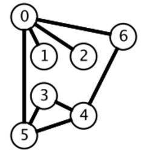

# 索引

- [算法思想](#算法思想)
    - [双指针](#双指针)
    - [排序](#排序)
    - [贪心思想](#贪心思想)
    - [二分查找](#二分查找)
    - [分治](#分治)
    - [搜索](#搜索)
    - [动态规划](#动态规划)
    - [数学](#数学)
    
- [数据结构相关](#数据结构相关)
    - [链表](#链表)
    - [树](#树)
    - [栈和队列](#栈和队列)
    - [哈希表](#哈希表)
    - [字符串](#字符串)
    - [数组和矩阵](#数组与矩阵)
    - [图](#图)
    - [位运算](#位运算)
    
- [参考[cyc2018-LeetCode题解]](https://github.com/CyC2018/CS-Notes/blob/master/notes/Leetcode%20%E9%A2%98%E8%A7%A3%20-%20%E7%9B%AE%E5%BD%95.md)

## 算法思想

#### 双指针

双指针主要用于遍历数组, 两个指针指向不同的元素, 从而协同完成任务, 包括指针碰撞, 快慢指针, 双指针

- [1. 有序数组的 Two Sum](https://leetcode-cn.com/problems/two-sum-ii-input-array-is-sorted/description/) [[java]](../src/lc167.java)
- [2. 两数平方和](https://leetcode-cn.com/problems/sum-of-square-numbers/description/) [[java]](../src/lc633.java)
- [3. 反转字符串中的元音字符](https://leetcode-cn.com/problems/sum-of-square-numbers/description/) [[java]](../src/lc345.java)
- [4. 回文字符串](https://leetcode-cn.com/problems/valid-palindrome-ii/description/) [[java]](../src/lc680.java)
- [5. 归并两个有序数组](https://leetcode-cn.com/problems/merge-sorted-array/description/) [[java]](../src/lc080.java)
- [6. 判断链表是否存在环](https://leetcode-cn.com/problems/linked-list-cycle/description/) [[java]](../src/lc141.java)
- [7. 最长子序列](https://leetcode-cn.com/problems/longest-word-in-dictionary-through-deleting/description/) [[java]](../src/lc524.java)

#### 排序

- 快速选择

    用于求解 Kth Element 问题, 也就是第 K 个元素的问题. 可以使用快速排序的 partition() 进行实现. 需要先打乱数组, 否则最坏情况下时间复杂度为 O(n ^ 2)
    
    - [Kth Element](https://leetcode-cn.com/problems/kth-largest-element-in-an-array/description/) [[java]](../src/lc215.java)
    
- 堆

    用于求解 TopK Elements 问题, 也就是 K 个最小元素的问题. 可以维护一个大小为 K 的最小堆, 最小堆中的元素就是最小元素. 最小堆需要使用大顶堆来实现, 大顶堆表示堆顶元素是堆中最大元素. 这是因为我们要得到 k 个最小的元素, 因此当遍历到一个新的元素时, 需要知道这个新元素是否比堆中最大的元素更小, 更小的话就把堆中最大元素去除, 并将新元素添加到堆中. 所以我们需要很容易得到最大元素并移除最大元素, 大顶堆就能很好满足这个要求.
    
    堆也可以用于求解 Kth Element 问题, 得到了大小为 k 的最小堆之后, 因为使用了大顶堆来实现, 因此堆顶元素就是第 k 大的元素.
    
    快速选择也可以求解 TopK Elements 问题, 因为找到 Kth Element 之后, 再遍历一次数组, 所有小于等于 Kth Element 的元素都是 TopK Elements. 
    
    可以看到, 快速选择和堆排序都可以求解 Kth Element 和 TopK Elements 问题
    
    - [出现频率最多的 k 个元素](https://leetcode-cn.com/problems/top-k-frequent-elements/description/) [[java]](../src/lc347.java)

- 桶排序
    
    - [按照字符出现次数对字符串排序](https://leetcode-cn.com/problems/sort-characters-by-frequency/description/) [[java]](../src/lc451.java)
    
- 荷兰国旗问题

    荷兰国旗包含三种颜色: 红, 白, 蓝.
    
    有三种颜色的球, 算法的目标是将这三种球按颜色顺序正确地排列. 它其实是三向切分快速排序的一种变种, 在三向切分快速排序中, 每次切分都将数组分成三个区间: 小于切分元素, 等于切分元素, 大于切分元素, 而该算法是将数组分成三个区间: 等于红色, 等于白色, 等于蓝色.
    
    - [按颜色进行排序](https://leetcode-cn.com/problems/sort-colors/description/) [[java]](../src/lc075.java)

#### 贪心思想

贪心算法一般用来解决需要"找到要做某事的最小数量"或"找到在某些情况下适合的最大物品数量"的问题, 且提供的是无序的输入

贪心算法的思想是每一步都选择最佳解决方案, 最终获得全局最佳的解决方案

标准解决方案具有O(n * logn)的时间复杂度且由以下两部分组成:

- 思考如何排序输入数据, O(n * logn)的时间复杂度

- 思考如何解析排序后的数据, O(n)的时间复杂度

如果输入数据本身有序, 则我们不需要进行排序, 那么该贪心算法具有O(n)的时间复杂度

如何证明你的贪心思想具有全局最优的效果: 可以使用反证法来证明

- [1. 分配饼干]() [[java]](../src/lc455.java)
- [2. 不重叠的区间个数]() [[java]](../src/lc435.java)
- [3. 投飞镖刺破气球]() [[java]](../src/lc452.java)
- [4. 根据身高和序号重组队列]() [[java]](../src/lc406.java)
- [5. 买卖股票最大的收益]() [[java]](../src/lc121.java)
- [6. 买卖股票的最大收益 II]() [[java]](../src/lc122.java)
- [7. 种植花朵]() [[java]](../src/lc605.java)
- [8. 判断是否为子序列]() [[java]](../src/lc392.java)
- [9. 修改一个数成为非递减数组]() [[java]](../src/lc665.java)
- [10. 子数组最大的和]() [[java]](../src/lc053.java)
- [11. 分隔字符串使同种字符出现在一起]() [[java]](../src/lc763.java)

#### 二分查找

正常实现

```
Input : [1,2,3,4,5]
key : 3
return the index : 2
```

```java
public int binarySearch(int[] nums, int key) {
    int l = 0, h = nums.length - 1;
    while (l <= h) {
        int m = l + (h - l) / 2;
        if (nums[m] == key) {
            return m;
        } else if (nums[m] > key) {
            h = m - 1;
        } else {
            l = m + 1;
        }
    }
    return -1;
}
```

时间复杂度

二分查找也称为折半查找，每次都能将查找区间减半，这种折半特性的算法时间复杂度为 O(logN)。

m 计算

有两种计算中值 m 的方式：

- m = (l + h) / 2
- m = l + (h - l) / 2
l + h 可能出现加法溢出，也就是说加法的结果大于整型能够表示的范围。但是 l 和 h 都为正数，因此 h - l 不会出现加法溢出问题。所以，最好使用第二种计算法方法。

未成功查找的返回值

循环退出时如果仍然没有查找到 key，那么表示查找失败。可以有两种返回值：

- -1：以一个错误码表示没有查找到 key
- l：将 key 插入到 nums 中的正确位置
变种

二分查找可以有很多变种，实现变种要注意边界值的判断。例如在一个有重复元素的数组中查找 key 的最左位置的实现如下：

```java
public int binarySearch(int[] nums, int key) {
    int l = 0, h = nums.length - 1;
    while (l < h) {
        int m = l + (h - l) / 2;
        if (nums[m] >= key) {
            h = m;
        } else {
            l = m + 1;
        }
    }
    return l;
}
```

该实现和正常实现有以下不同：

- h 的赋值表达式为 h = m
- 循环条件为 l < h
- 最后返回 l 而不是 -1

在 nums[m] >= key 的情况下，可以推导出最左 key 位于 [l, m] 区间中，这是一个闭区间。h 的赋值表达式为 h = m，因为 m 位置也可能是解。

在 h 的赋值表达式为 h = m 的情况下，如果循环条件为 l <= h，那么会出现循环无法退出的情况，因此循环条件只能是 l < h。以下演示了循环条件为 l <= h 时循环无法退出的情况：

```
nums = {0, 1, 2}, key = 1
l   m   h
0   1   2  nums[m] >= key
0   0   1  nums[m] < key
1   1   1  nums[m] >= key
1   1   1  nums[m] >= key
...
```
当循环体退出时，不表示没有查找到 key，因此最后返回的结果不应该为 -1。为了验证有没有查找到，需要在调用端判断一下返回位置上的值和 key 是否相等。

- [1. 求开方](https://leetcode-cn.com/problems/sqrtx/description/) [[java]](../src/lc069.java)
- [2. 大于给定元素的最小元素](https://leetcode-cn.com/problems/find-smallest-letter-greater-than-target/description/) [[java]](../src/lc744.java)
- [3. 有序数组的 Single Element](https://leetcode-cn.com/problems/single-element-in-a-sorted-array/description/) [[java]](../src/lc540.java)
- [4. 第一个错误的版本](https://leetcode-cn.com/problems/first-bad-version/description/) [[java]](../src/lc278.java)
- [5. 旋转数组的最小数字](https://leetcode-cn.com/problems/find-minimum-in-rotated-sorted-array/description/) [[java]](../src/lc153.java)
- [6. 查找区间](https://leetcode-cn.com/problems/find-first-and-last-position-of-element-in-sorted-array/) [[java]](../src/lc034.java)

#### 分治

- [1. 给表达式加括号](https://leetcode-cn.com/problems/different-ways-to-add-parentheses/) [[java]](../src/lc241.java)
- [2. 不同的二叉搜索树](https://leetcode-cn.com/problems/unique-binary-search-trees-ii/) [[java]](../src/lc095.java)

#### 搜索

深度优先搜索和广度优先搜索广泛运用于树和图中, 但是它们的应用远远不止如此. 

- BFS

     

    广度优先搜索一层一层地进行遍历, 每层遍历都以上一层遍历的结果作为起点, 遍历一个距离能访问到的所有节点. 需要注意的是, 遍历过的节点不能再次被遍历.

    第一层:

        0 -> {6, 2, 1, 5}
    
    第二层:

        6 -> {4}
        2 -> {}
        1 -> {}
        5 -> {3}
    第三层:

        4 -> {}
        3 -> {}
    
    每一层遍历的节点都与根节点距离相同. 设 di 表示第 i 个节点与根节点的距离, 推导出一个结论: 对于先遍历的节点i与后遍历的节点 j, 有 di <= dj. 利用这个结论, 可以求解最短路径等 `最优解` 问题: 第一次遍历到目的节点, 其所经过的路径为最短路径. 应该注意的是, 使用 BFS 只能求解无权图的最短路径, 无权图是指从一个节点到另一个节点的代价都记为 1.

    在程序实现 BFS 时需要考虑以下问题:

    - 队列: 用来存储每一轮遍历得到的节点;
    - 标记: 对于遍历过的节点, 应该将它标记, 防止重复遍历.
    
    - [1. 计算在网格中从原点到特定点的最短路径长度](https://leetcode-cn.com/problems/shortest-path-in-binary-matrix/) [[java]](../src/lc1091.java)
    - [2. 组成整数的最小平方数数量](https://leetcode-cn.com/problems/perfect-squares/) [[java]](../src/lc279.java)
    - [3. 最短单词路径](https://leetcode-cn.com/problems/word-ladder/) [[java]](../src/lc127.java)
    
- DFS

    

    广度优先搜索一层一层遍历, 每一层得到的所有新节点, 要用队列存储起来以备下一层遍历的时候再遍历.

    而深度优先搜索在得到一个新节点时立即对新节点进行遍历: 从节点 0 出发开始遍历, 得到到新节点 6 时, 立马对新节点 6 进行遍历, 得到新节点 4; 如此反复以这种方式遍历新节点, 直到没有新节点了, 此时返回. 返回到根节点 0 的情况是, 继续对根节点 0 进行遍历, 得到新节点 2, 然后继续以上步骤.

    从一个节点出发, 使用 DFS 对一个图进行遍历时, 能够遍历到的节点都是从初始节点可达的, DFS 常用来求解这种 `可达性` 问题.

    在程序实现 DFS 时需要考虑以下问题:

    栈: 用栈来保存当前节点信息, 当遍历新节点返回时能够继续遍历当前节点. 可以使用递归栈.
    标记: 和 BFS 一样同样需要对已经遍历过的节点进行标记.

    - [1. 矩阵中的连通分量数目]() [[java]](../src/lc200.java)
    - [2. 查找最大的连通面积]() [[java]](../src/lc695.java)
    - [3. 好友关系的连通分量数目]() [[java]](../src/lc547.java)
    - [4. 填充封闭区域]() [[java]](../src/lc130.java)
    - [5. 能到达的太平洋和大西洋的区域]() [[java]](../src/lc417.java)
    
    
#### 动态规划

#### 数学

## 数据结构相关

#### 链表

#### 树

#### 栈和队列

#### 哈希表

#### 字符串

#### 数组与矩阵

#### 图

#### 位运算